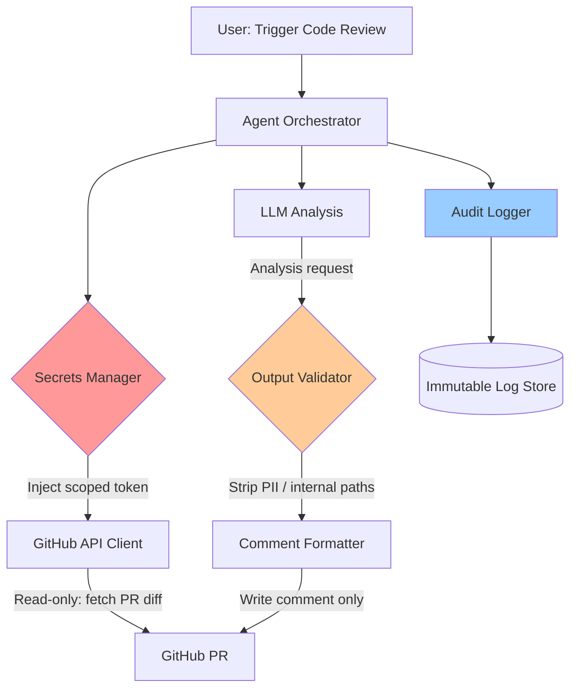

# Workflow 1 — Least-Privilege API Access Agent

## What It Does

A code-review agent that reads GitHub pull requests, analyzes code for security issues, and posts comments — but has **no ability to merge, push, or delete** anything.

This workflow demonstrates how to scope a production agent to the absolute minimum access required for its stated purpose.

---

## Security Controls Applied

| Control | Implementation |
|---------|---------------|
| Read-only GitHub token | Scoped to `pull_requests:read` and `issues:write` only |
| No admin permissions | Merge, push, delete explicitly excluded |
| Secrets at runtime | Token injected from Vault at run start, not stored in env |
| Output filtering | Agent comments cannot contain raw code paths or internal system names |
| Rate limiting | Max 100 GitHub API calls and 20 LLM calls per run |
| Short-lived token TTL | Token expires after 1 hour regardless of run status |

---

## Architecture



---

## Configuration

See [`configs/least-privilege-agent.yaml`](../configs/least-privilege-agent.yaml) for the full agent configuration.

Key sections:
```yaml
agent:
  permissions:
    github:
      scopes: ["pull_requests:read", "issues:write"]
      allow_merge: false
      allow_push: false
      allow_delete: false
  rate_limits:
    api_calls_per_run: 100
    llm_calls_per_run: 20
  secrets:
    source: vault
    ttl: 3600
```

---

## The Principle

> An agent that only needs to read should never be given write credentials.
> An agent that only needs to write comments should never be given merge permissions.
> The cost of over-permissioning is paid during an incident, not during setup.

---

*Next: [Workflow 2 — Secrets Management →](02-secrets-management.md)*
