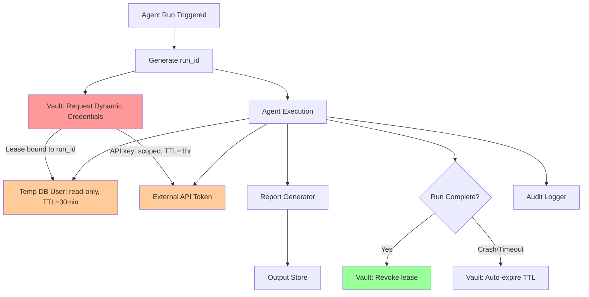

# Workflow 2 — Secrets Management for Agent Credentials

## What It Does

A data-pipeline agent that queries multiple databases and external APIs to generate a daily business report — with all credentials managed entirely outside the agent's context window.

---

## Security Controls Applied

| Control | Implementation |
|---------|---------------|
| Dynamic secrets | Vault generates a temporary DB user per run, auto-revoked after |
| No static credentials | No passwords in env vars, code, config files, or prompts |
| Lease bound to run_id | If the run crashes, the credential lease expires automatically |
| Credential request logged | Agent ID, run ID, and timestamp recorded on every fetch |
| Read-only DB role | Vault's DB role grants SELECT only — no INSERT, UPDATE, DELETE |

---

## Architecture



---

## Implementation

```python
import hvac
import uuid
import contextlib


@contextlib.contextmanager
def agent_credentials(vault_client, agent_name: str, run_id: str):
    """
    Fetches credentials at run start.
    Guarantees revocation at run end — even on crash.
    """
    lease_ids = []
    try:
        # Vault generates a temporary DB user with read-only access
        db_creds = vault_client.secrets.database.generate_credentials(
            name=f"{agent_name}-db-role"
        )
        lease_ids.append(db_creds['lease_id'])

        # Scoped API key fetched from Vault KV store
        api_secret = vault_client.secrets.kv.v2.read_secret_version(
            path=f"agents/{agent_name}/api-key"
        )

        yield {
            "db_user": db_creds['data']['username'],
            "db_pass": db_creds['data']['password'],   # Never logged
            "api_key": api_secret['data']['data']['key']  # Never logged
        }
    finally:
        # Runs even if agent raised an exception
        for lease_id in lease_ids:
            vault_client.sys.revoke_lease(lease_id)


# Usage
run_id = str(uuid.uuid4())
with agent_credentials(vault, "report-agent", run_id) as creds:
    run_report_agent(creds)
# Credentials are revoked here — guaranteed
```

---

## What Never To Do

```python
# ❌ Credentials in code
DB_PASSWORD = "super_secret_password_123"

# ❌ Credentials in environment variables committed to repo
# export DB_PASSWORD=super_secret_password_123

# ❌ Credentials passed directly to the LLM prompt
prompt = f"Connect to the database with password {db_password} and run this query..."

# ❌ Credentials in agent-to-agent messages
message = {"recipient": "analyst-agent", "payload": {"db_pass": db_password}}
```

---

*Next: [Workflow 3 — Audit Logging →](03-audit-logging-pipeline.md)*
