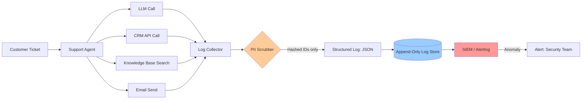

# Workflow 3 — Audit Logging & Traceability Pipeline

## What It Does

A customer support agent that handles tickets end-to-end — where every single action is written to an immutable audit trail for compliance, debugging, and incident investigation.

---

## Security Controls Applied

| Control | Implementation |
|---------|---------------|
| Structured JSON logging | Consistent schema across all agent steps |
| No raw PII in logs | Customer data hashed before logging |
| Append-only log store | Logs cannot be modified after write |
| Run-level correlation | Every entry carries `run_id` to reconstruct a full session |
| Anomaly alerting | Rules fire on suspicious patterns (see `anomaly-detection-rules.yaml`) |

---

## Architecture



---

## Log Schema

Every log entry must include these fields:

```json
{
  "timestamp": "2025-09-01T14:23:01.452Z",
  "run_id": "3f7a2b91-...",
  "agent_id": "support-agent-v2",
  "environment": "production",
  "action_type": "tool_call",
  "tool_name": "crm.lookup_customer",
  "input_hash": "sha256:a3f4b2...",
  "output_hash": "sha256:9c1d3e...",
  "customer_id_hash": "sha256:ff2a91...",
  "duration_ms": 234,
  "status": "success",
  "llm_model": "claude-3-5-sonnet",
  "token_count": { "input": 1240, "output": 87 }
}
```

> **Note:** `input_hash` and `output_hash` are SHA-256 hashes of the raw content. The raw content is never written to logs. If you need to investigate, re-hash the suspected input and compare.

---

## Anomaly Detection Rules

See [`configs/anomaly-detection-rules.yaml`](../configs/anomaly-detection-rules.yaml) for the full ruleset.

---

*Next: [Workflow 4 — MCP Access Control Gateway →](04-mcp-access-control-gateway.md)*
