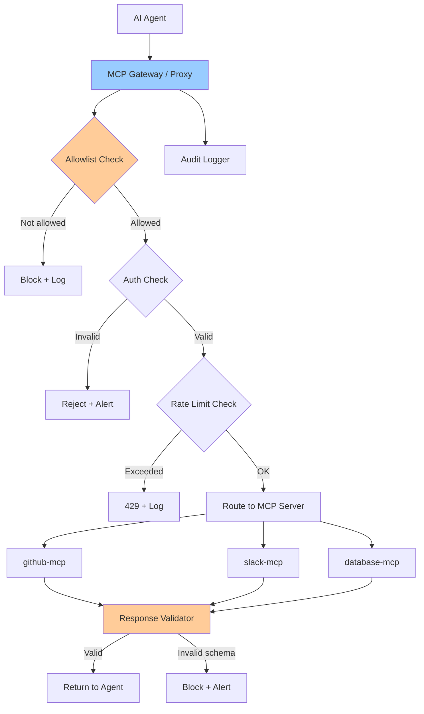

# Workflow 4 — MCP Server Access Control Gateway

## What It Does

A gateway proxy sits between AI agents and all Model Context Protocol servers, enforcing authentication, allowlisting, rate limiting, and logging on every tool invocation.

---

## Security Controls Applied

| Control | Implementation |
|---------|---------------|
| Server allowlist | Agents can only connect to pre-approved MCP servers |
| Per-agent permissions | Each agent has its own approved server + tool list |
| Request signing | All MCP requests carry a signed JWT with agent identity |
| Response validation | MCP responses validated against schemas before the agent receives them |
| Rate limiting | Per agent, per MCP server |
| Full request logging | Request + response metadata logged at the gateway layer |

---

## Architecture

---

## Configuration

See [`configs/mcp-gateway.yaml`](../configs/mcp-gateway.yaml) for the full gateway configuration.

---

*Next: [Workflow 5 — Multi-Agent Zero Trust →](05-multi-agent-zero-trust.md)*
