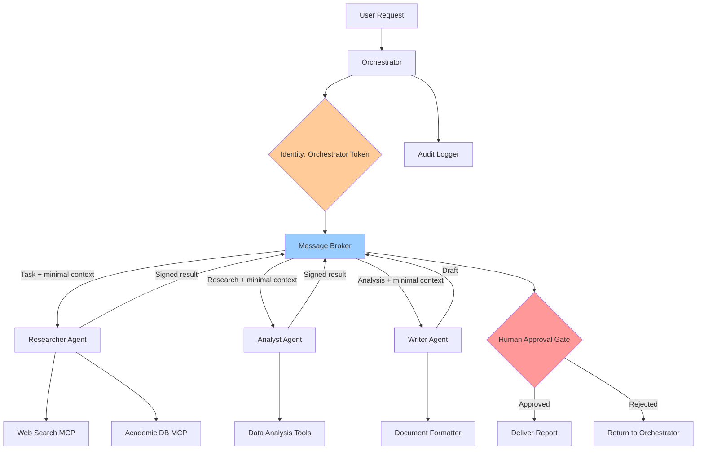

# Workflow 5 — Multi-Agent Zero Trust Orchestration

## What It Does

A research-and-reporting pipeline with three specialized agents — researcher, analyst, writer — where each agent communicates through a verified message broker, and no agent can directly invoke another agent's tools.

---

## Security Controls Applied

| Control | Implementation |
|---------|---------------|
| Agent identity tokens | Each agent has a cryptographically signed identity |
| Message broker intermediary | Agents never communicate directly |
| Capability isolation | Each agent has a strictly defined, non-overlapping toolset |
| Context minimization | Each agent receives only the data needed for its specific task |
| Human-in-the-loop gate | Human approval required before final report is delivered |
| Timeout + circuit breaker | Any agent exceeding 5 minutes is killed and logged |

---

## Architecture



---

## Context Minimization Pattern

```python
# ❌ WRONG — full context passed to every agent
input_for_all = {
    "user_profile": full_user_profile,
    "company_data": all_company_data,
    "previous_reports": all_history,
    "topic": topic,
}

# ✅ CORRECT — each agent gets only what it needs
researcher_input = {
    "topic": topic,
    "scope": scope,
    "run_id": run_id,
}

analyst_input = {
    "research_findings": researcher_output["findings"],
    "analysis_framework": analysis_type,
    "run_id": run_id,
}

writer_input = {
    "analysis_summary": analyst_output["summary"],
    "report_format": report_format,
    "run_id": run_id,
}
```

---

## Signed Message Pattern

```python
import jwt, time, uuid

def sign_message(agent_id: str, signing_key: str, payload: dict) -> dict:
    """Every outgoing inter-agent message is signed."""
    return {
        **payload,
        "signature": jwt.encode({
            "sender_id": agent_id,
            "payload_hash": hash_dict(payload),
            "iat": time.time(),
            "exp": time.time() + 300,  # expires in 5 minutes
        }, signing_key, algorithm="HS256")
    }

def verify_message(message: dict, sender_public_key: str) -> bool:
    """Recipient verifies sender identity before processing."""
    try:
        decoded = jwt.decode(
            message["signature"], sender_public_key, algorithms=["HS256"]
        )
        return decoded["sender_id"] == message["sender_id"]
    except jwt.InvalidTokenError:
        return False
```

---

## The Zero Trust Principle Applied to Agents

Traditional Zero Trust: *"Never trust, always verify"* — applied to users and devices.

**Agentic Zero Trust:** *"Never trust, always verify"* — applied to agents and their messages.

- The researcher's output is not trusted by the analyst just because they're in the same system
- The analyst's output is not trusted by the writer just because the orchestrator sent it
- Every message is signed. Every signature is verified. Every action is logged.

---

*Back to [README →](../README.md)*
