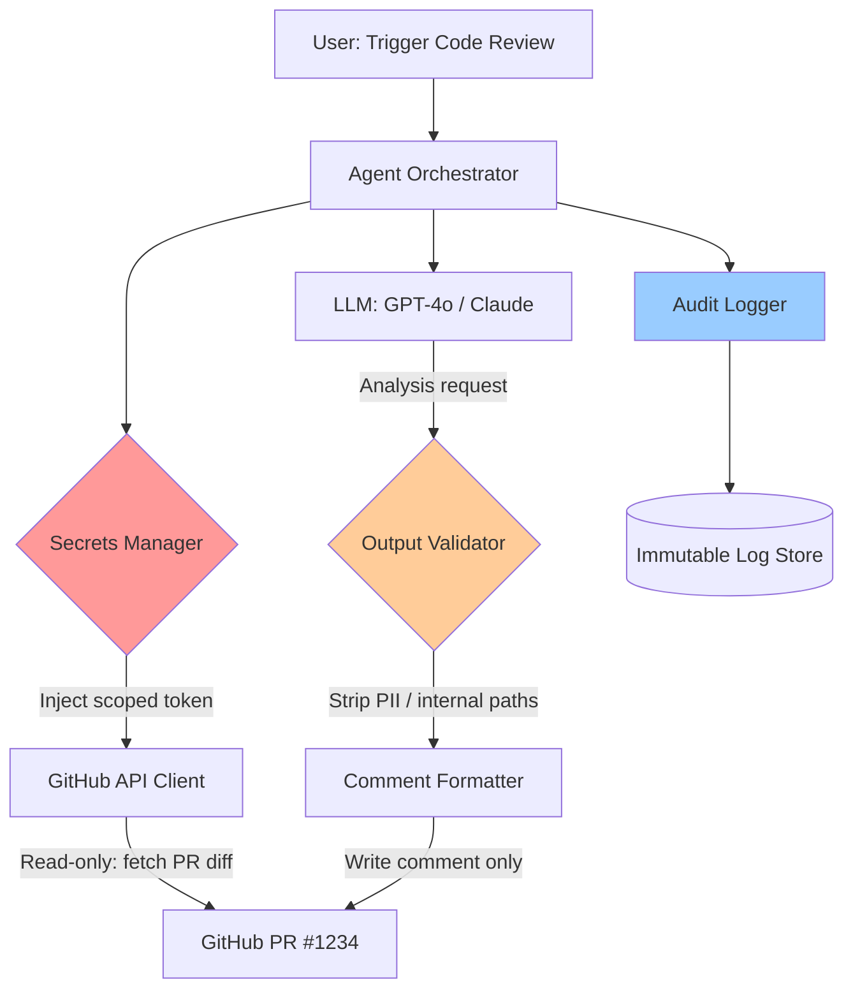
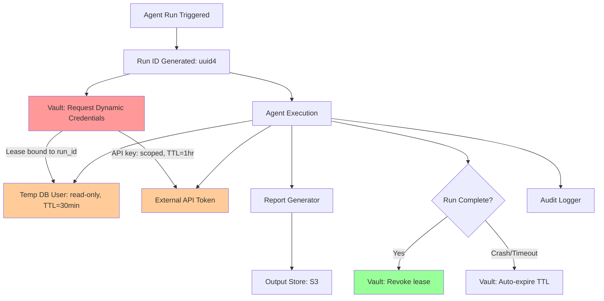
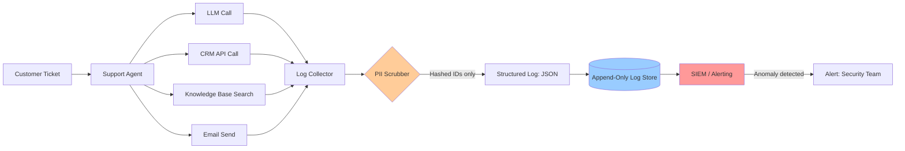
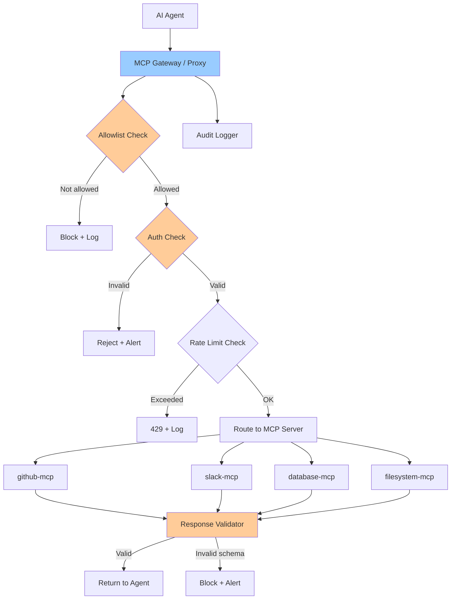
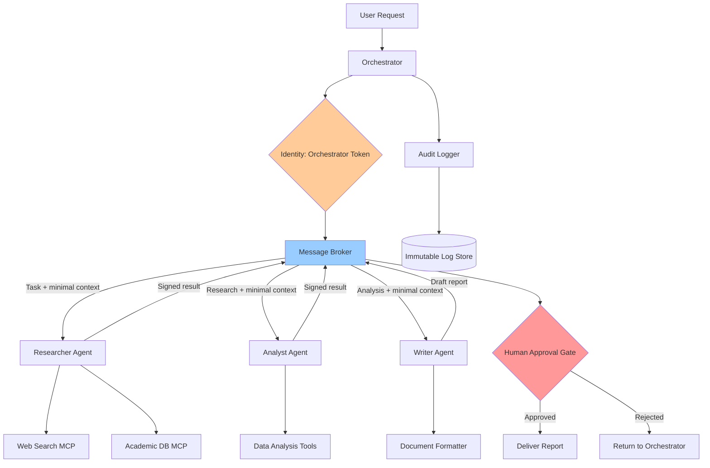

# ⚙️🔒 AgentOps Security Workflows

> **Production-grade operational patterns for running AI agents securely — with real architecture diagrams, least-privilege principles, and audit-ready controls.**

[](LICENSE)
[]()
[](CONTRIBUTING.md)

---

## 📖 Table of Contents

- [What Is AgentOps?](#what-is-agentops)
- [Security-First Principles](#security-first-principles)
- [Workflow 1 — Least-Privilege API Access Agent](#workflow-1--least-privilege-api-access-agent)
- [Workflow 2 — Secrets Management for Agent Credentials](#workflow-2--secrets-management-for-agent-credentials)
- [Workflow 3 — Audit Logging & Traceability Pipeline](#workflow-3--audit-logging--traceability-pipeline)
- [Workflow 4 — MCP Server Access Control Gateway](#workflow-4--mcp-server-access-control-gateway)
- [Workflow 5 — Multi-Agent Zero Trust Orchestration](#workflow-5--multi-agent-zero-trust-orchestration)
- [Security Checklist](#security-checklist)
- [Contributing](#contributing)

---

## What Is AgentOps?

**AgentOps** is the practice of operating AI agents in production with the same rigor that DevOps/SRE teams apply to software systems — but with additional considerations unique to autonomous AI:

- Agents make **non-deterministic decisions** — their behavior can't be fully predicted from code review alone
- Agents have **compounding blast radius** — a single misconfigured agent can cascade across dozens of downstream systems
- Agents operate **at machine speed** — by the time a human notices something wrong, thousands of actions may have already executed
- Agents **consume secrets** — API keys, OAuth tokens, and credentials are part of how agents function, making them a high-value attack target

In a **security-first AgentOps** context, every workflow must answer:

| Question | Control |
|----------|---------|
| Who authorized this agent run? | **Identity & attribution logging** |
| What can this agent access? | **Least-privilege scoping** |
| What did this agent actually do? | **Immutable audit trail** |
| Can this agent be stopped? | **Circuit breakers & kill switches** |
| Are secrets safe? | **Secrets management, no hard-coding** |
| Are MCP connections trusted? | **MCP server allowlisting & auth** |

---

## Security-First Principles

### 1. Least Privilege

> *An agent should have the minimum permissions required to complete its task — and nothing more.*

- Never grant write access when read-only is sufficient
- Scope API keys to specific services and operations
- Use short-lived tokens (TTL of minutes/hours, not days/months)
- Create separate credentials per agent, per environment

### 2. Audit Logging

> *Every agent action must be logged with enough context to reconstruct exactly what happened and why.*

Required fields in every log entry:
```
- timestamp (ISO 8601, UTC)
- agent_id
- run_id (unique per execution)
- action_type (tool_call | llm_call | human_handoff | error)
- tool_name (if applicable)
- input_hash (SHA-256 of inputs — don't log raw sensitive data)
- output_hash (SHA-256 of outputs)
- user_id / requestor
- environment (dev | staging | prod)
- duration_ms
- status (success | failure | timeout)
```

### 3. Secrets Management

> *No secret ever touches an agent's context window, codebase, or logs.*

- Use a dedicated secrets manager (HashiCorp Vault, AWS Secrets Manager, Azure Key Vault)
- Inject secrets as environment variables at runtime, not build time
- Rotate credentials on a schedule and on any suspected compromise
- Use separate secret namespaces per agent and per environment

### 4. Input/Output Validation

> *Treat every input to an agent as potentially adversarial. Treat every output as potentially dangerous.*

- Validate and sanitize all inputs before they reach the LLM
- Scan outputs for sensitive data patterns (PII, credentials, internal system names) before returning them
- Apply prompt injection detection on all user-provided inputs

### 5. MCP Server Controls

> *Model Context Protocol servers are network-exposed tool endpoints. Treat them like microservices — with authentication, scoping, and monitoring.*

- Maintain an allowlist of approved MCP servers per agent
- Require authentication on every MCP server (OAuth, API key, mTLS)
- Rate-limit MCP server requests per agent
- Log all MCP tool invocations with full request/response metadata

---

## Workflow 1 — Least-Privilege API Access Agent

### What It Does

A code-review agent that reads GitHub pull requests, analyzes code for security issues, and posts comments — but has **no ability to merge, push, or delete** anything.

### Security Controls Applied

- **Read-only GitHub token** scoped to `pull_requests:read` and `issues:write` only
- **No repo-level admin permissions**
- **Token stored in secrets manager**, injected at runtime
- **Output filtered** — agent comments cannot contain raw code snippets or internal system paths
- **Rate limiting** — max 100 API calls per run to prevent runaway loops

### Architecture



**ASCII fallback:**
```
User Request
     │
     ▼
Agent Orchestrator
     │
     ├──▶ Secrets Manager ──▶ [Injects: READ-ONLY GitHub Token]
     │           │
     │           ▼
     │    GitHub API Client
     │           │
     │           ▼
     │    Fetch PR Diff (read only)
     │
     ├──▶ LLM Analysis
     │           │
     │           ▼
     │    Output Validator (strips PII, paths)
     │           │
     │           ▼
     │    Post Comment (write comment only)
     │
     └──▶ Audit Logger ──▶ Immutable Log Store
```

### Key Configuration

```yaml
agent:
  name: code-review-agent
  permissions:
    github:
      scopes: ["pull_requests:read", "issues:write"]
      allow_merge: false
      allow_push: false
      allow_delete: false
  rate_limits:
    api_calls_per_run: 100
    llm_calls_per_run: 20
  secrets:
    source: vault
    path: agents/code-review/github-token
    ttl: 3600  # 1 hour
```

---

## Workflow 2 — Secrets Management for Agent Credentials

### What It Does

A data-pipeline agent that queries multiple databases and external APIs to generate a daily business report — with credentials managed entirely outside the agent's context.

### Security Controls Applied

- **HashiCorp Vault** (or AWS Secrets Manager) as the sole secrets source
- **Dynamic secrets** — Vault generates a temporary DB user with read-only access for each run, auto-revoked after completion
- **No credentials in environment variables, code, or LLM context**
- **Credential request is logged** with agent ID, run ID, and timestamp
- **Secret lease is bound to run_id** — if the run crashes, the lease expires and credentials are invalidated

### Architecture



### Key Implementation Pattern

```python
import hvac  # HashiCorp Vault client
import uuid
import contextlib

@contextlib.contextmanager
def agent_credentials(vault_client, agent_name: str, run_id: str):
    """
    Context manager that fetches credentials at run start
    and guarantees revocation at run end — even on crash.
    """
    lease_ids = []
    try:
        # Request dynamic DB credentials (Vault auto-creates temp user)
        db_creds = vault_client.secrets.database.generate_credentials(
            name=f"{agent_name}-db-role"
        )
        lease_ids.append(db_creds['lease_id'])

        # Request scoped API key from Vault KV store
        api_secret = vault_client.secrets.kv.v2.read_secret_version(
            path=f"agents/{agent_name}/api-key"
        )

        yield {
            "db_user": db_creds['data']['username'],
            "db_pass": db_creds['data']['password'],  # Never log this
            "api_key": api_secret['data']['data']['key']  # Never log this
        }
    finally:
        # Always revoke — runs in finally so crash doesn't skip this
        for lease_id in lease_ids:
            vault_client.sys.revoke_lease(lease_id)

# Usage in agent:
run_id = str(uuid.uuid4())
with agent_credentials(vault, "report-agent", run_id) as creds:
    run_report_agent(creds)
# Credentials are revoked here — even if the agent raised an exception
```

---

## Workflow 3 — Audit Logging & Traceability Pipeline

### What It Does

A customer support agent that handles tickets end-to-end — but every single action is logged to an immutable audit trail for compliance, debugging, and incident investigation.

### Security Controls Applied

- **Structured JSON logging** with consistent schema across all agent steps
- **No raw PII in logs** — customer data is hashed before logging
- **Append-only log store** (AWS CloudTrail, Splunk, or similar) — logs cannot be modified after write
- **Run-level correlation** — every log entry carries `run_id` so you can reconstruct a full session
- **Alert rules** on anomalous patterns (e.g., agent touching > N records in < T seconds)

### Architecture



### Log Schema

```json
{
  "timestamp": "2025-09-01T14:23:01.452Z",
  "run_id": "3f7a2b91-...",
  "agent_id": "support-agent-v2",
  "environment": "production",
  "action_type": "tool_call",
  "tool_name": "crm.lookup_customer",
  "input_hash": "sha256:a3f4b2...",
  "output_hash": "sha256:9c1d3e...",
  "customer_id_hash": "sha256:ff2a91...",
  "duration_ms": 234,
  "status": "success",
  "llm_model": "claude-3-5-sonnet",
  "token_count": { "input": 1240, "output": 87 },
  "user_id": "agent-system",
  "requestor_id": "ticket:TKT-8821"
}
```

### Anomaly Detection Rules

```python
ANOMALY_RULES = [
    {
        "name": "high_volume_crm_access",
        "condition": "tool_name == 'crm.lookup_customer' AND count_per_minute > 50",
        "action": "alert_and_pause"
    },
    {
        "name": "repeated_failures",
        "condition": "status == 'failure' AND count_per_run > 10",
        "action": "alert_and_terminate"
    },
    {
        "name": "unexpected_tool_use",
        "condition": "tool_name NOT IN agent.allowed_tools",
        "action": "block_and_alert"
    },
    {
        "name": "data_exfiltration_pattern",
        "condition": "output_size_bytes > 100000 AND tool_name CONTAINS 'read'",
        "action": "quarantine_and_alert"
    }
]
```

---

## Workflow 4 — MCP Server Access Control Gateway

### What It Does

An MCP gateway sits between AI agents and all Model Context Protocol servers, enforcing authentication, allowlisting, rate limiting, and logging on every tool invocation.

### Security Controls Applied

- **MCP server allowlist** — agents can only connect to pre-approved MCP servers
- **Per-agent MCP permissions** — agent A may use `github-mcp` but not `database-mcp`
- **Request signing** — all MCP requests carry a signed JWT with agent identity
- **Response validation** — MCP server responses are validated against expected schemas before the agent receives them
- **Rate limiting** per agent per MCP server
- **Full request/response logging** at the gateway layer

### Architecture



### Gateway Configuration

```yaml
mcp_gateway:
  auth:
    method: jwt
    signing_key_env: MCP_GATEWAY_SIGNING_KEY
    token_ttl: 900  # 15 minutes

  agents:
    - id: research-agent
      allowed_servers:
        - name: github-mcp
          url: https://mcp.github.com/sse
          allowed_tools: ["search_repositories", "read_file", "list_issues"]
          rate_limit: "30/minute"
        - name: brave-search-mcp
          url: https://mcp.brave.com/sse
          allowed_tools: ["web_search"]
          rate_limit: "20/minute"

    - id: support-agent
      allowed_servers:
        - name: crm-mcp
          url: https://internal-crm.company.com/mcp
          allowed_tools: ["lookup_customer", "create_ticket", "update_ticket"]
          rate_limit: "60/minute"
          # NOTE: delete_customer is NOT in allowed_tools

  logging:
    level: full  # Log request + response metadata (not raw content)
    destination: splunk
    include_fields:
      - agent_id
      - server_name
      - tool_name
      - input_hash
      - response_schema_valid
      - duration_ms
      - timestamp
```

---

## Workflow 5 — Multi-Agent Zero Trust Orchestration

### What It Does

A complex research-and-reporting pipeline with three specialized agents — a researcher, an analyst, and a writer — where each agent communicates through a message broker with identity verification, and no agent can directly call another agent's tools.

### Security Controls Applied

- **Agent identity tokens** — each agent has a cryptographically signed identity; no anonymous agent communication
- **Message broker intermediary** — agents never communicate directly; all messages go through a verified broker
- **Capability isolation** — each agent has a strictly defined toolset; the researcher cannot write, the writer cannot search
- **Human-in-the-loop checkpoint** — before the final report is delivered, a human approval step is required
- **Context minimization** — each agent receives only the data it needs for its specific task, not the full context
- **Timeout + circuit breaker** — if any agent takes more than 5 minutes, the orchestrator kills the run and logs the failure

### Architecture



### Zero Trust Message Pattern

```python
import jwt
import time
from dataclasses import dataclass
from typing import Any

@dataclass
class AgentMessage:
    """Every inter-agent message is signed and verified."""
    sender_id: str
    recipient_id: str
    run_id: str
    payload: dict[str, Any]
    issued_at: float
    signature: str

def sign_message(agent_id: str, signing_key: str, payload: dict) -> AgentMessage:
    """Agent signs every outgoing message with its identity key."""
    token_payload = {
        "sender_id": agent_id,
        "run_id": payload.get("run_id"),
        "payload_hash": hash_dict(payload),
        "iat": time.time(),
        "exp": time.time() + 300  # Message expires in 5 minutes
    }
    signature = jwt.encode(token_payload, signing_key, algorithm="HS256")
    return AgentMessage(
        sender_id=agent_id,
        recipient_id=payload["recipient"],
        run_id=payload["run_id"],
        payload=payload,
        issued_at=token_payload["iat"],
        signature=signature
    )

def verify_message(message: AgentMessage, sender_public_key: str) -> bool:
    """Recipient verifies sender identity before processing message."""
    try:
        decoded = jwt.decode(
            message.signature,
            sender_public_key,
            algorithms=["HS256"]
        )
        # Verify payload hasn't been tampered with
        assert decoded["payload_hash"] == hash_dict(message.payload)
        # Verify sender identity matches claimed sender
        assert decoded["sender_id"] == message.sender_id
        return True
    except (jwt.ExpiredSignatureError, jwt.InvalidTokenError, AssertionError):
        return False
```

### Context Minimization Pattern

```python
# ❌ WRONG — Passing full context to every agent
researcher_input = {
    "user_request": user_request,
    "user_profile": full_user_profile,      # Analyst doesn't need this
    "company_data": all_company_data,       # Writer doesn't need this
    "previous_reports": all_previous_reports  # Researcher doesn't need this
}

# ✅ CORRECT — Each agent gets only what it needs
researcher_input = {
    "topic": user_request["topic"],
    "scope": user_request["scope"],
    "run_id": run_id
    # Nothing else. Researcher doesn't need user PII or company internals.
}

analyst_input = {
    "research_findings": researcher_output["findings"],
    "analysis_framework": user_request["analysis_type"],
    "run_id": run_id
    # No raw user data. No company internal data beyond the research.
}

writer_input = {
    "analysis_summary": analyst_output["summary"],
    "report_format": user_request["format"],
    "run_id": run_id
    # No raw research. No user PII. Just what the writer needs to write.
}
```

---

## Security Checklist

Before deploying any agent workflow to production, verify all of the following:

### Identity & Access

- [ ] Every agent has a unique, scoped identity credential
- [ ] No shared credentials between agents or environments
- [ ] All API keys are stored in a secrets manager (not env vars, not code)
- [ ] All credentials are short-lived with automatic rotation
- [ ] Least-privilege scoping applied to every credential

### Audit & Observability

- [ ] Every agent action produces a structured log entry
- [ ] Logs are written to an append-only, tamper-evident store
- [ ] Logs do not contain raw PII or credential data
- [ ] A `run_id` correlates all actions within a single agent execution
- [ ] Anomaly detection rules are active and tested

### MCP & Tool Controls

- [ ] An allowlist of approved MCP servers is defined per agent
- [ ] MCP connections require authentication
- [ ] MCP requests are rate-limited per agent
- [ ] MCP responses are schema-validated before reaching the agent
- [ ] Agent tool permissions explicitly exclude destructive operations where not required

### Input/Output Safety

- [ ] User inputs are sanitized for prompt injection before reaching the LLM
- [ ] Agent outputs are scanned for PII and sensitive data before delivery
- [ ] Maximum output size limits are enforced
- [ ] Human approval gates are in place for high-impact actions

### Operational Controls

- [ ] Circuit breakers exist to halt runaway agents
- [ ] Maximum run time (TTL) is enforced per agent execution
- [ ] A kill switch or pause mechanism is available for all running agents
- [ ] Staging environment mirrors production security controls

---

## Contributing

Security best practices evolve. If you have a workflow pattern, control, or configuration that has served you well in production, please contribute.

1. Fork this repo
2. Add your workflow to the appropriate section with: what it does, security controls, and an architecture diagram
3. Open a pull request with a brief explanation of the threat it addresses

---

*For the full Agentic AI landscape → [agentic-ai-landscape](https://github.com/YOUR_USERNAME/agentic-ai-landscape)*

*For Cisco's open-source AI security tools → [cisco-ai-security-toolkit](https://github.com/YOUR_USERNAME/cisco-ai-security-toolkit)*

---

*Maintained with ❤️ for the AI security community.*
